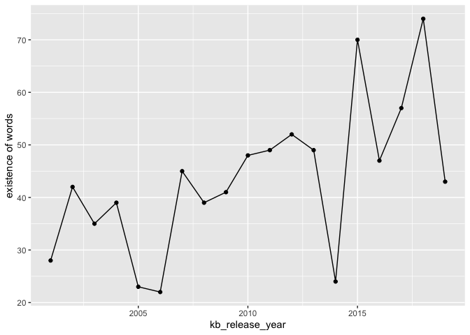
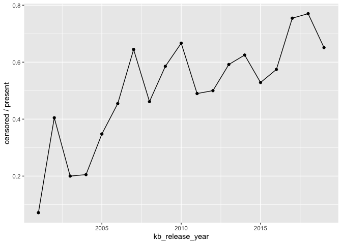
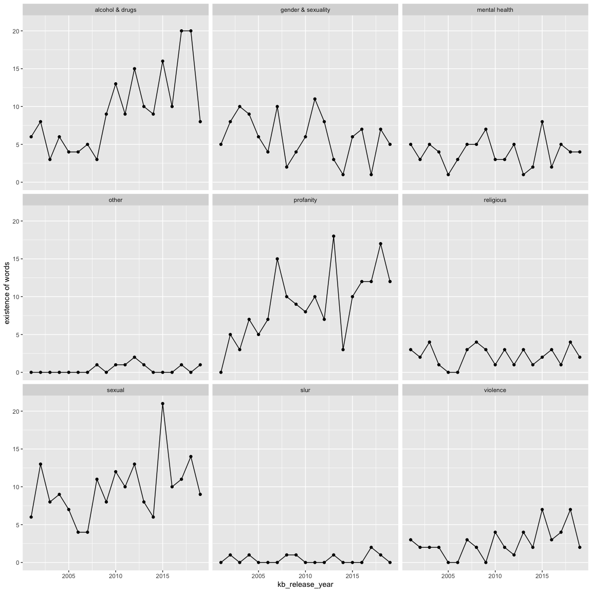
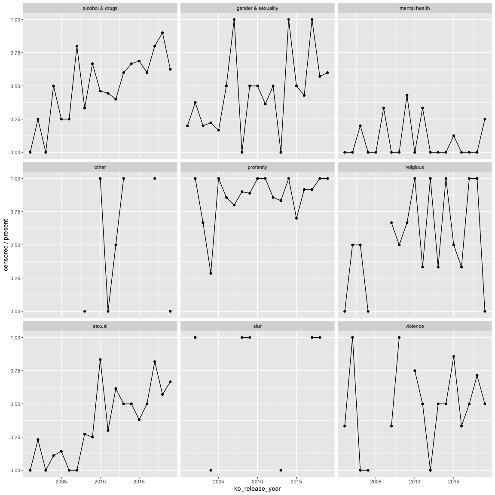
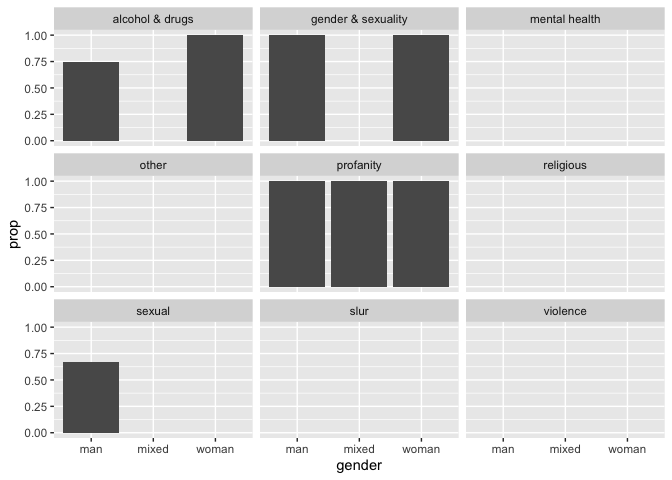

Censoring Exploration
================
Sara Stoudt
2/16/2020

``` r
library(dplyr)
library(ggplot2)

setwd("~/Desktop/kidz-bop-data/")
badWordSummary = read.csv("data/censoring/censoringTimes.csv", stringsAsFactors = F)
fullData = read.csv("data/censoring/fullDataSet.csv", stringsAsFactors = F)

load(file="data/2020-02-02/ogLyricsFullPlain.RData") ## ogLyricsFull
load(file="data/2020-02-02/kbLyrics.RData") ## kbLyrics

kb40_gender <- read.csv("data/2020-02-02/originalArtists_gender-KB_40.csv", stringsAsFactors = F)
```

## What is being censored by category?

``` r
fullData %>% group_by(category) %>% summarise(countCensored=sum(isCensored), count = sum(isPresent)) %>% mutate(prop = countCensored/count)
```

    ## # A tibble: 9 x 4
    ##   category           countCensored count  prop
    ##   <chr>                      <int> <int> <dbl>
    ## 1 alcohol & drugs              102   178 0.573
    ## 2 gender & sexuality            49   113 0.434
    ## 3 mental health                  8    75 0.107
    ## 4 other                          4     8 0.5  
    ## 5 profanity                    149   170 0.876
    ## 6 religious                     21    41 0.512
    ## 7 sexual                        74   184 0.402
    ## 8 slur                           6     8 0.75 
    ## 9 violence                      28    50 0.56

## Consistency of Censoring

``` r
## took a while to censor
badWordSummary$bad_word[which(badWordSummary$firstCensored>badWordSummary$firstAppear)]
```

    ##  [1] "booty"     "bottle"    "bullet"    "champagne" "chest"     "coke"     
    ##  [7] "crazy"     "devil"     "dope"      "drink"     "drug"      "gang"     
    ## [13] "god"       "grind"     "high"      "insane"    "kill"      "kiss"     
    ## [19] "lips"      "men"       "pill"      "smoking"   "tattoo"    "touch"    
    ## [25] "trigger"   "woman"

``` r
## confirms livin la vida loca

## sometimes not censored
badWordSummary$bad_word[which(badWordSummary$numPresent>badWordSummary$numCensored)]
```

    ##  [1] "bang"      "blood"     "blow"      "booty"     "bottle"    "bullet"   
    ##  [7] "champagne" "chest"     "coke"      "crazy"     "dammit"    "damn"     
    ## [13] "devil"     "dope"      "drink"     "drug"      "gang"      "god"      
    ## [19] "grind"     "gun"       "hell"      "high"      "insane"    "juice"    
    ## [25] "kill"      "kiss"      "knife"     "lips"      "man"       "men"      
    ## [31] "murder"    "nigga"     "pill"      "sex"       "skin"      "smoke"    
    ## [37] "smoking"   "tattoo"    "touch"     "trigger"   "vodka"     "woman"

``` r
## some of these seem like they should always be censored

## always censored
badWordSummary$bad_word[which(badWordSummary$numPresent==badWordSummary$numCensored)]
```

    ##  [1] "ass"         "beer"        "bitch"       "cigarette"   "drunk"      
    ##  [6] "fuck"        "gay"         "intoxicate"  "jesus"       "lesbian"    
    ## [11] "liquor"      "masturbate"  "molly"       "overdose"    "pimp"       
    ## [16] "pussy"       "shit"        "transgender" "wine"        "women"

``` r
## women?
```

## Looking into consistency

``` r
fullData %>% filter(isPresent & bad_word =="nigga")
```

    ##   bad_word kbID bad_word_idx isStillPresent og_idx isPresent
    ## 1    nigga  264           16          FALSE    256      TRUE
    ## 2    nigga  305           16          FALSE    291      TRUE
    ## 3    nigga  536           16           TRUE    508      TRUE
    ## 4    nigga  260           16          FALSE    622      TRUE
    ## 5    nigga  474           16           TRUE    451      TRUE
    ## 6    nigga  258           16          FALSE    245      TRUE
    ## 7    nigga  116           16          FALSE    108      TRUE
    ## 8    nigga  428           16          FALSE    665      TRUE
    ##           kb_song_name         og_artist og_release_year kb_release_year
    ## 1       in my feelings             Drake            2018            2018
    ## 2       live your life              T.I.            2008            2009
    ## 3 u don't have to call             Usher            2001            2004
    ## 4          i'm the one         DJ Khaled            2017            2017
    ## 5           suit & tie Justin Timberlake            2013            2013
    ## 6             i'm real    Jennifer Lopez            2001            2002
    ## 7      congratulations       Post Malone            2016            2017
    ## 8 see you again (2007)            Eazy-E            1996            2008
    ##   isCensored category
    ## 1       TRUE     slur
    ## 2       TRUE     slur
    ## 3      FALSE     slur
    ## 4       TRUE     slur
    ## 5      FALSE     slur
    ## 6       TRUE     slur
    ## 7       TRUE     slur
    ## 8       TRUE     slur

``` r
#kbLyrics[[474]] %>% View()
#kbLyrics[[536]] %>% View()

fullData %>% filter(isPresent & bad_word =="dammit")
```

    ##   bad_word kbID bad_word_idx isStillPresent og_idx isPresent      kb_song_name
    ## 1   dammit  198           37          FALSE    190      TRUE gotta be somebody
    ## 2   dammit  237           37           TRUE    228      TRUE             i cry
    ##    og_artist og_release_year kb_release_year isCensored  category
    ## 1 Nickelback            2008            2009       TRUE profanity
    ## 2   Flo Rida            2012            2013      FALSE profanity

Kidz Bop words do have the word in it on Genius:

<https://genius.com/Kidz-bop-kids-suit-and-tie-lyrics>

<https://genius.com/Kidz-bop-kids-u-dont-have-to-call-lyrics>

<https://genius.com/Kidz-bop-kids-i-cry-lyrics>

``` r
fullData %>% filter(isPresent & bad_word =="women")
```

    ##   bad_word kbID bad_word_idx isStillPresent og_idx isPresent
    ## 1    women  276           68          FALSE    623      TRUE
    ## 2    women  140           68          FALSE    133      TRUE
    ## 3    women  102           68          FALSE     93      TRUE
    ## 4    women  129           68          FALSE    121      TRUE
    ##           kb_song_name                   og_artist og_release_year
    ## 1 jenny from the block              Jennifer Lopez            2002
    ## 2         don't matter                        Akon            2006
    ## 3  chicken noodle soup Genius English Translations            2019
    ## 4          dance again              Jennifer Lopez            2012
    ##   kb_release_year isCensored           category
    ## 1            2003       TRUE gender & sexuality
    ## 2            2007       TRUE gender & sexuality
    ## 3            2007       TRUE gender & sexuality
    ## 4            2012       TRUE gender & sexuality

``` r
#kbLyrics[[276]] %>% View()
## intro with "women" not present, does keep god in though fyi

#kbLyrics[[140]] %>% View()
#ogLyricsFull[[133]] %>% View()
## Women steady comin' after me 
## Men steady comin' after you  

## switched to girls and boys
```

Intro with “women” not present in “Jenny From the Block.” Kidz Bop does
keep “god” in though FYI.

In Akon’s song: “Women steady comin’ after me,” “Men steady comin’ after
you.” Kidz Bop changes this to “girls” and “boys”

So it looks like we have some false negatives, not sure what to do about
that.

## Censoring over time

``` r
overTime = fullData %>% group_by(kb_release_year) %>% summarise(countCensored=sum(isCensored), count = sum(isPresent)) %>% mutate(prop = countCensored/count)

ggplot(overTime, aes(kb_release_year,count))+geom_point()+geom_line()+ylab("existence of words")
```

<!-- -->

``` r
# picking songs that don't need as much censoring?

ggplot(overTime, aes(kb_release_year,prop))+geom_point()+geom_line()+ylab("censored / present")
```

<!-- -->

``` r
# proportion of potentially problematic words being removed over time
```

Well that is
striking.

## Time Trends Per Category

``` r
overTime = fullData %>% group_by(kb_release_year,category) %>% summarise(countCensored=sum(isCensored), count = sum(isPresent)) %>% mutate(prop = countCensored/count)


ggplot(overTime, aes(kb_release_year,count))+geom_point()+geom_line()+facet_wrap(~category)+ylab("existence of words")
```

<!-- -->

``` r
ggplot(overTime, aes(kb_release_year,prop))+geom_point()+geom_line()+facet_wrap(~category)+ylab("censored / present")
```

    ## Warning: Removed 30 rows containing missing values (geom_point).

<!-- -->

Slight increase in existence of alcohol & drugs and profanity over time.

Censorship of alcohol and drugs, sexual groups increasing over
time.

## Kidz Bop 40 Gender

``` r
kb40 = fullData %>% filter(kb_release_year == max(fullData$kb_release_year)) 
kb40_gender$song = tolower(kb40_gender$song)

test = merge(kb40, kb40_gender, by.x="kb_song_name", by.y="song",all.y=T, all.x=F) 

test %>% filter(!is.na(og_idx)) %>% group_by(gender) %>% summarise(countCensored = sum(isCensored), count = sum(isPresent))
```

    ## # A tibble: 3 x 3
    ##   gender countCensored count
    ##   <chr>          <int> <int>
    ## 1 man                8    12
    ## 2 mixed              2     2
    ## 3 woman              8    10

``` r
toP = test %>% filter(!is.na(og_idx)) %>% group_by(gender,category) %>% summarise(countCensored = sum(isCensored), count = sum(isPresent)) %>% mutate(prop = countCensored/count)


ggplot(toP, aes(gender, prop))+geom_bar(stat = "identity") +facet_wrap(~category)
```

    ## Warning: Removed 15 rows containing missing values (position_stack).

<!-- -->

A little too sparse to see anything.
