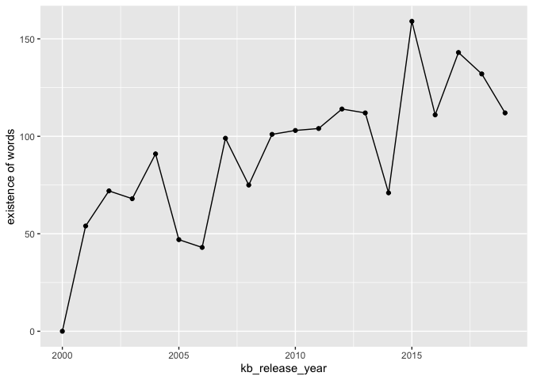
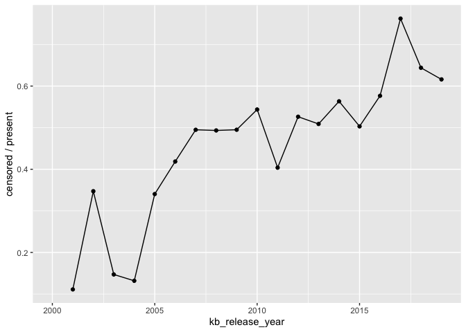
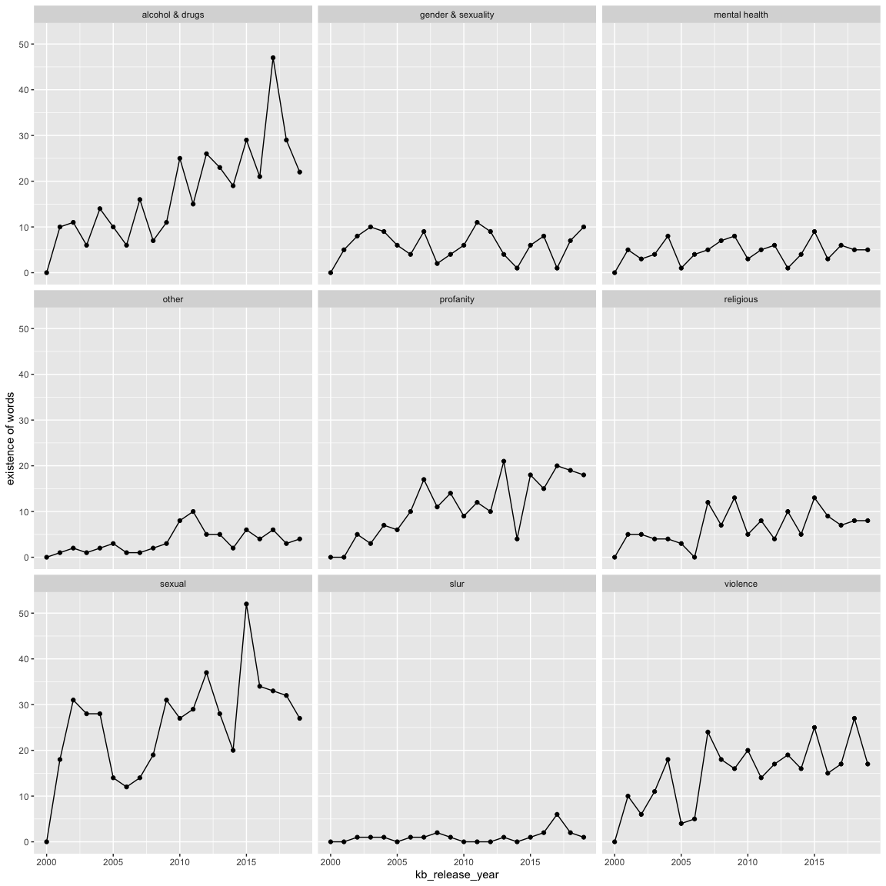

Censoring Exploration
================
Sara Stoudt
2/16/2020

``` r
library(dplyr)
library(ggplot2)

setwd("~/Desktop/kidz-bop-data/")
#badWordSummary = read.csv("data/censoring/censoringTimes.csv", stringsAsFactors = F)
#fullData = read.csv("data/censoring/fullDataSet.csv", stringsAsFactors = F)
fullData = read.csv("data/missing/fullCensor.csv", stringsAsFactors = F)

#load(file="data/2020-02-02/ogLyricsFullPlain.RData") ## ogLyricsFull
#load(file="data/2020-02-02/kbLyrics.RData") ## kbLyrics

#kb40_gender <- read.csv("data/2020-02-02/originalArtists_gender-KB_40.csv", stringsAsFactors = F)
```

## What is being censored by category?

``` r
fullData %>% group_by(category) %>% summarise(countCensored=sum(isCensored), count = sum(isPresent)) %>% mutate(prop = countCensored/count) %>% arrange(desc(prop))
```

    ## # A tibble: 9 x 4
    ##   category           countCensored count  prop
    ##   <chr>                      <int> <int> <dbl>
    ## 1 profanity                    196   219 0.895
    ## 2 slur                          15    21 0.714
    ## 3 alcohol & drugs              199   347 0.573
    ## 4 gender & sexuality            53   120 0.442
    ## 5 sexual                       209   514 0.407
    ## 6 other                         28    69 0.406
    ## 7 violence                     120   299 0.401
    ## 8 religious                     50   130 0.385
    ## 9 mental health                 15    92 0.163

## Censoring over time

``` r
overTime = fullData %>% group_by(kb_release_year) %>% summarise(countCensored=sum(isCensored), count = sum(isPresent)) %>% mutate(prop = countCensored/count)

ggplot(overTime, aes(kb_release_year,count))+geom_point()+geom_line()+ylab("existence of words")
```

<!-- -->

``` r
# picking songs that don't need as much censoring?

ggplot(overTime, aes(kb_release_year,prop))+geom_point()+geom_line()+ylab("censored / present")
```

    ## Warning: Removed 1 rows containing missing values (geom_point).

    ## Warning: Removed 1 rows containing missing values (geom_path).

<!-- -->

``` r
# proportion of potentially problematic words being removed over time
```

Well that is
striking.

## Time Trends Per Category

``` r
overTime = fullData %>% group_by(kb_release_year,category) %>% summarise(countCensored=sum(isCensored), count = sum(isPresent)) %>% mutate(prop = countCensored/count)


ggplot(overTime, aes(kb_release_year,count))+geom_point()+geom_line()+facet_wrap(~category)+ylab("existence of words")
```

<!-- -->

``` r
ggplot(overTime, aes(kb_release_year,prop))+geom_point()+geom_line()+facet_wrap(~category)+ylab("censored / present")
```

    ## Warning: Removed 17 rows containing missing values (geom_point).

    ## Warning: Removed 1 rows containing missing values (geom_path).

<!-- -->

Slight increase in existence of alcohol & drugs and profanity over time.

Censorship of alcohol and drugs, sexual groups increasing over time.
